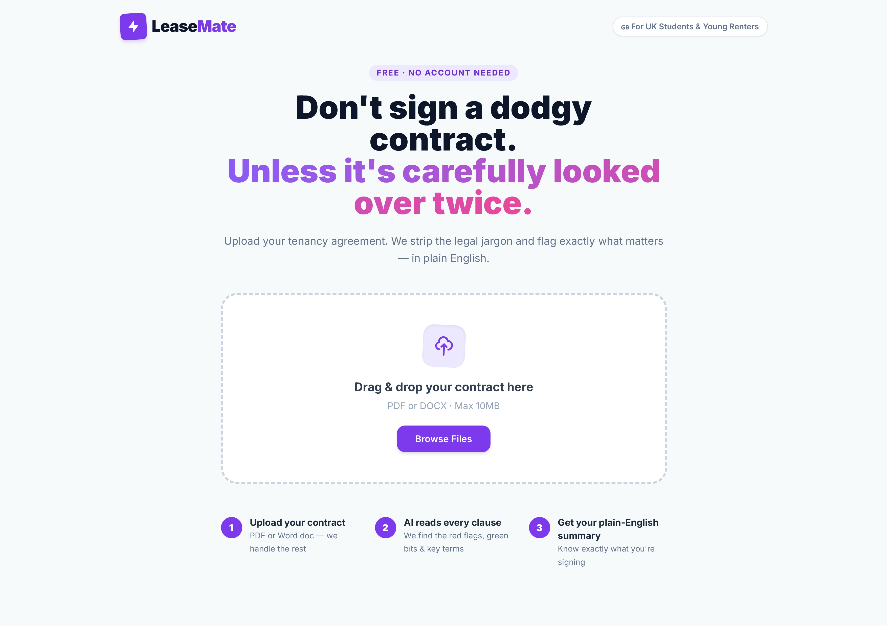
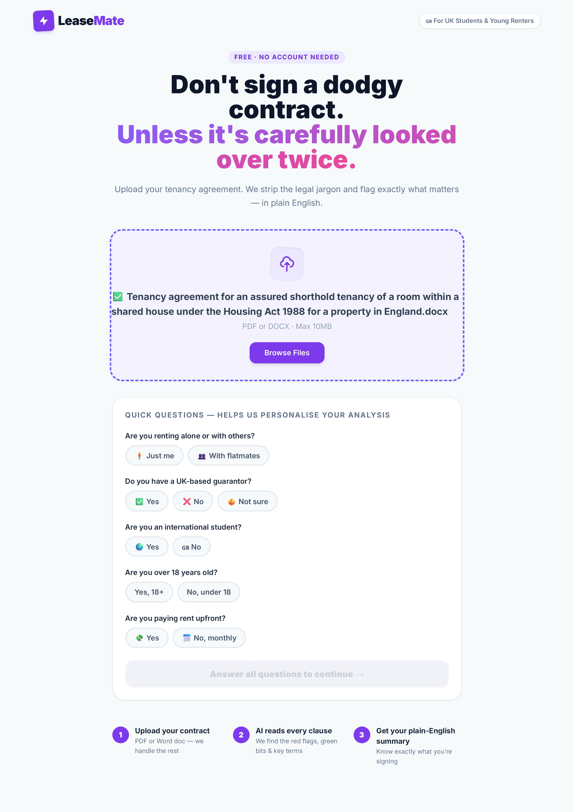
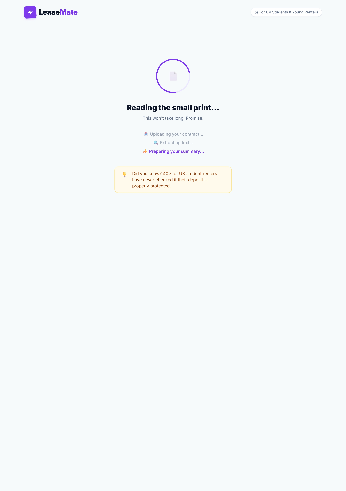
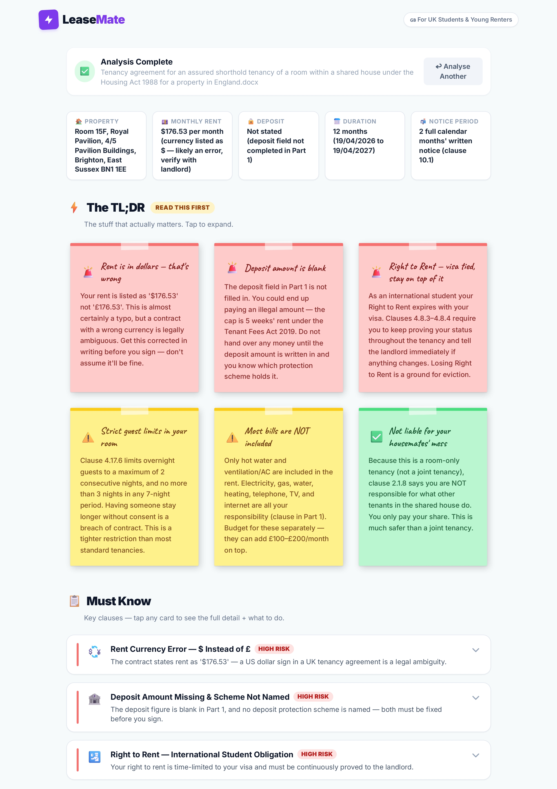
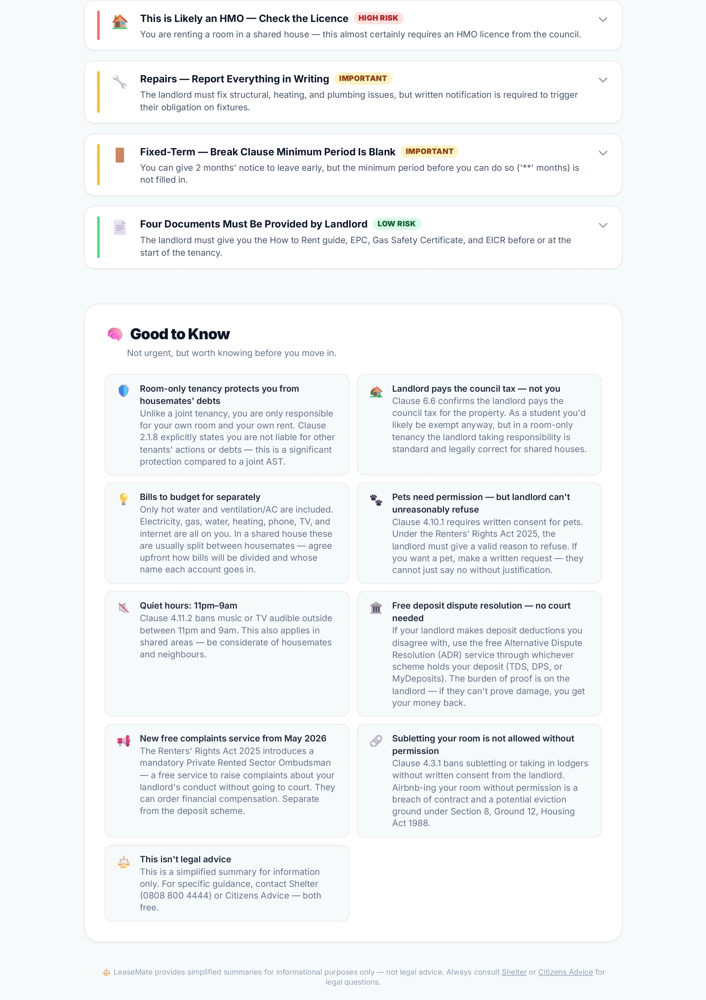

# LeaseMate 🏠

> **A student-friendly rental contract analyser for UK renters under 25.**
> Built at HackSussex 2026.

[](https://hacksussex-2026.devpost.com/)
[](https://devpost.com/software/leasemate)
[](https://flask.palletsprojects.com/)
[](https://tailwindcss.com/)

---

## 💡 Inspiration

Many young adults — especially students under 25 — don't fully understand rental contracts or their legal rights. Agreements are full of complex legal jargon that's easy to sign without truly understanding. LeaseMate was built to change that: a tool that strips the legalese, flags the risks, and explains exactly what you're agreeing to — in plain English.

---

## 🔍 What It Does

Upload your rental contract (PDF or DOCX). Answer 5 quick questions about your situation. LeaseMate extracts the contract text, personalises the analysis to your circumstances, and presents the results as:

- 📌 **Post-it flags** — danger, warning, and good news at a glance
- 📋 **Must Know cards** — severity-ranked issues with legal citations and action steps
- 💡 **Good to Know** — useful context (council tax exemption, quiet enjoyment, etc.)
- 🔑 **Key Terms strip** — rent, deposit, duration, notice period pulled instantly

---

## 📸 Screenshots

| | |
|---|---|
|  |  |
| *Homepage* | *Post-upload questionnaire* |
|  |  |
| *Processing screen* | *Results — highlights* |


*Results — full breakdown*

---

## 🛠️ How We Built It

| Layer | Tech |
|---|---|
| Frontend | HTML5, Vanilla JavaScript, Tailwind CSS |
| Backend | Python, Flask |
| Document parsing | PyMuPDF (PDF), python-docx (DOCX) |
| AI pipeline | Prompt engineering + custom UK housing law YAML knowledge base |
| Output format | Structured JSON → rendered dynamically by the frontend |

The AI pipeline works without an API key. Contract text is extracted server-side, prepended with a `[STUDENT CONTEXT]` block from the questionnaire, and fed manually into any LLM alongside our YAML knowledge base and strict output prompt. The LLM returns pure JSON — dropped into `output/results.json` — and the frontend polls and renders it automatically within 3 seconds.

---

## ⚙️ Running Locally

### Prerequisites
```
Python 3.9+
pip install flask pymupdf python-docx
```

### Setup
```bash
git clone https://github.com/FrostKazi/LeaseMate.git
cd LeaseMate
python app.py
```

Open `http://127.0.0.1:5000` in your browser.

> **Note:** The `extracted/` folder is excluded from the repo to protect contract data — it will be created automatically on first upload.

---

## 🔄 The Manual AI Pipeline

LeaseMate uses a deliberate human-in-the-loop flow (no API key required):

1. **Upload** your contract → text is extracted and saved to `extracted/`
2. **Paste** `AI_SESSION_STARTER.md` + the YAML knowledge base + the extracted `.txt` into any LLM (ChatGPT, Claude, Gemini)
3. **Copy** the JSON output → drop it into `output/results.json`
4. The webpage **auto-detects** the file and renders results within 3 seconds

---

## 🧠 Challenges

- **AI hallucination** — solved by engineering a ground-truth prompt system anchored entirely to a custom YAML knowledge base of UK housing law (including the upcoming Renters' Rights Act 2025)
- **Messy document extraction** — PDFs with complex layouts and tables required careful handling with PyMuPDF
- **Strict JSON output** — heavy prompt tuning was needed to prevent the LLM from adding any conversational text that would break the frontend parser

---

## 🏆 Accomplishments

- Built a legal tool that speaks Gen-Z without dumbing down UK housing law
- Grounded the AI with a custom YAML covering 33 legal clauses across 11 law sections
- Connected a full pipeline: 30-page PDF legalese → personalised student context → structured JSON → intuitive visual dashboard
- Includes the Renters' Rights Act 2025 — legislation most tools haven't caught up with yet

---

## 🚀 What's Next

We want to bring LeaseMate to Student Unions so it can help real students with their rental contracts. This is a first prototype — the foundation is solid, and we're confident it can genuinely protect young renters.

---

## 👥 Team

Built at **HackSussex 2026** by:

- [Kazi Abdul Baset](https://devpost.com/FrostKazi)
- [Leonie Ma](https://devpost.com/lsy-ma2006)
- [Muhammad Fachrul Hudallah](https://devpost.com/fachrulhuda79)
- [Sadia Malik](https://devpost.com/sadia133)

---

## ⚖️ Disclaimer

LeaseMate provides simplified summaries for informational purposes only — not legal advice. For specific guidance, contact [Shelter](https://england.shelter.org.uk) (0808 800 4444) or [Citizens Advice](https://www.citizensadvice.org.uk/housing) — both free.
